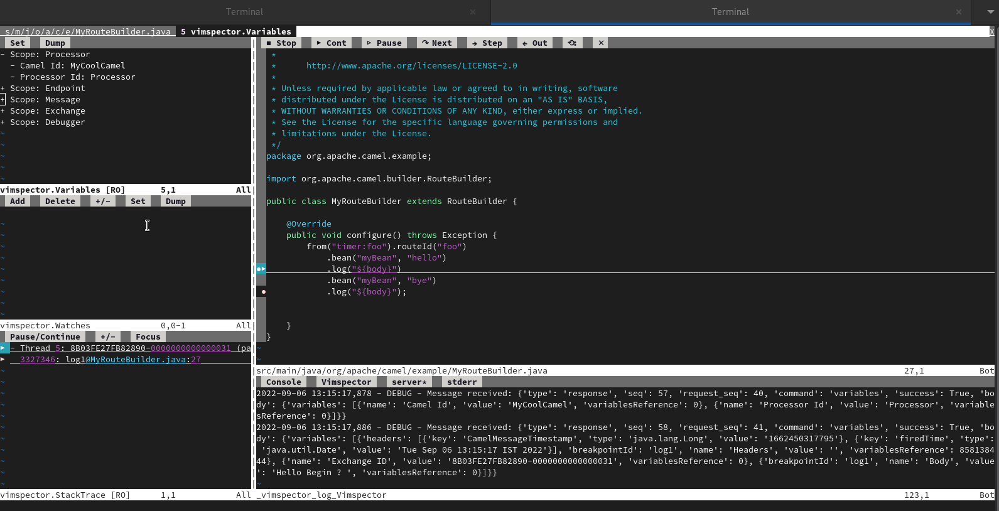

# VIM Debug Adapter client for Apache Camel



# How to debug camel with vim
I just got the debug integration for camel in vim running using vimspector(https://github.com/puremourning/vimspector). In order to not forget the config, I decided to quickly compile this readme.

The following manual uses `Vi IMproved 9.0` and `:vim-plug` plugin manager.

# Install
Install the vimspector using vim-plug plugin manager.

Inside `.vimrc` file:

`Plug 'puremourning/vimspector'`

# Install it:

`:PlugInstall`

# How to get camel DAPserver.jar file?
- I found 2 releases of camel DAP server here - https://github.com/camel-tooling/ 
  camel-debug-adapter/tags but it doesn't contain any jar files 
- Download from Maven Central repository - https://repo1.maven.org/maven2/com/github/camel-tooling/camel-dap-server/0.4.0/camel-dap-server-0.4.0.jar
	
# Inside .vimrc file:
```
  call plug#begin()
  " The default plugin directory will be as follows:
  "   - Vim (Linux/macOS): '~/.vim/plugged'
  "   - Vim (Windows): '~/vimfiles/plugged'
  "   - Neovim (Linux/macOS/Windows): stdpath('data') . '/plugged'
  " You can specify a custom plugin directory by passing it as the argument
  "   - e.g. `call plug#begin('~/.vim/plugged')`
  "   - Avoid using standard Vim directory names like 'plugin'
  "
  "
  " Use release branch (recommend)
  Plug 'neoclide/coc.nvim', {'branch': 'release'}
  Plug 'puremourning/vimspector'
  call plug#end()
  
  " https://github.com/puremourning/vimspector/blob/master/README.md#human-mode"
  let g:vimspector_enable_mappings = 'HUMAN'

  " Vimspector key mappings 
  nnoremap <Leader>dd :call vimspector#Launch()<CR>
  nnoremap <Leader>dt :call vimspector#ToggleBreakpoint()<CR>
  nnoremap <Leader>dc :call vimspector#Continue()<CR>
  nnoremap <Leader>de :call vimspector#Reset()<CR>
```

# Configure camel-example Debug Gadget
Place this content in `cust_camel-debug-adapter.json` in your vimspector directory (path might be different for you)
```sh
cd ~/.vim/plugged/vimspector/gadgets/linux/.gadgets.d
```
Vimspector adapter configuration:
```json
{
  "adapters": {
    "cust_camel-debug-adapter": {
         "command": [
        "java",
        "-jar",
        "/home/camel-debug-adapter-0.4.0/target/camel-dap-server-0.4.0.jar"
         ]
    }
  }
}
```
# Vimspector Config
 Create a file called `.vimspector.json` in the project root and then place the following content

 Vimspector debugger configuration:
 ```json
{
  "configurations": {
    "Camel Debug Adapter - Attach": {
      "adapter": "cust_camel-debug-adapter",
      "configuration": {
        "request": "attach",
        "sourcePaths": [ "${workspaceRoot}/src/main/java" ],
        "hostName": "localhost",
        "port": "${JVMDebugPort}",
        "stepFilters": {
          "skipClasses": [ "$$JDK" ]
        }
      }
    }
  }
}
```
# Troubleshooting

## In terminal window1:

* To start the debugger port:
```sh
  cd ~/camel-examples/examples/main
```
- mvn camel:run -Pcamel.debug

## In terminal window2:
```sh
  cd ~/camel-examples/examples/main
```
- vim src/main/java/org/apache/camel/example/MyBean.java
- Add the following content inside `MyBean.java` file:
```java
package org.apache.camel.example;

public class MyBean {

    private String hi;

    public MyBean(String hi) {
        this.hi = hi;
    }

    public String hello() {
        return hi + " Begin ? ";

    }
     public String bye() {
        return hi + " End ? ";
}
}
```
- vim src/main/java/org/apache/camel/example/MyRouteBuilder.java 
- Inside `MyRouteBuilder.java` file:
```java
package org.apache.camel.example;

import org.apache.camel.builder.RouteBuilder;

public class MyRouteBuilder extends RouteBuilder {

    @Override
    public void configure() throws Exception {
        from("timer:foo").routeId("foo")
            .bean("myBean", "hello")
            .log("${body}")
            .bean("myBean", "bye")
            .log("${body}");
    }
}
```
# Debug It
Now everything is in place. Open the main MyRouteBuilder file and start debugging by `Esc + \`:
| Key          | Function
| ---          | ---
| `dd`         | To start the camel debugger
| `dt`         | To set the breakpoints
| `dc`         | To go to the next breakpoint
| `ctrl+ww`    | To move around the vimspector 
`:VimspectortToggleLog` to see the vimspector logs.
`cat $HOME/.vimspector.log` same logs can also be seen here

# Mappings
The goal is to provide keymapping to use controllers of the debugger more easily. Try the following mappings, by adding the following before loading vimspector:
```viml
let g:vimspector_enable_mappings = 'HUMAN'
```

| Key          | Mapping                                       | Function
| ---          | ---                                           | ---
| `F5`         | `<Plug>VimspectorContinue`                    | When debugging, continue. Otherwise start debugging.
| `F3`         | `<Plug>VimspectorStop`                        | Stop debugging.
| `F4`         | `<Plug>VimspectorRestart`                     | Restart debugging with the same configuration.
| `F6`         | `<Plug>VimspectorPause`                       | Pause debuggee.
| `F9`         | `<Plug>VimspectorToggleBreakpoint`            | Toggle line breakpoint on the current line.
| `<leader>F9` | `<Plug>VimspectorToggleConditionalBreakpoint` | Toggle conditional line breakpoint or logpoint on the current line.
| `F8`         | `<Plug>VimspectorAddFunctionBreakpoint`       | Add a function breakpoint for the expression under cursor
| `<leader>F8` | `<Plug>VimspectorRunToCursor`                 | Run to Cursor